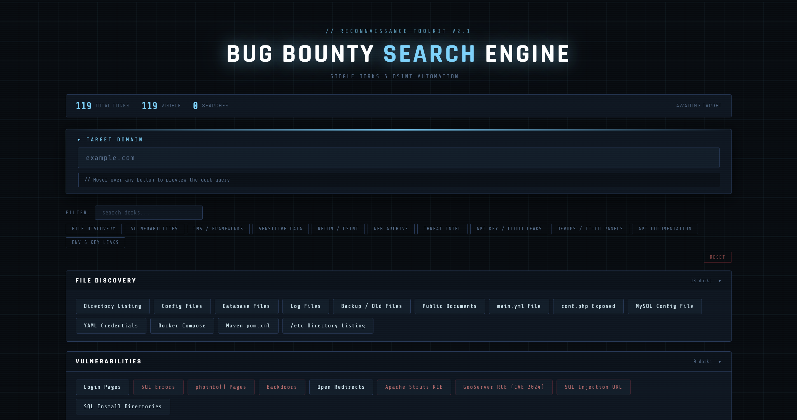

<p align="center">
  
</p>
<h1 align="center">Bug Bounty Search Engine</h1>
<p align="center">
  
  
  
  
</p>

---

A zero-dependency, single-file reconnaissance tool that auto-generates Google Dork queries for a given target domain and links directly to popular OSINT and Threat Intel platforms. No installation needed — open in browser, enter domain, search.

> **⚠️ DISCLAIMER:** This tool is for **educational and authorized security testing purposes only**. Unauthorized use against systems you do not own or have explicit permission to test is illegal. Always obtain proper authorization before testing.

---

## ⚡ Features

- **500+ Google Dorks** — organized across 11 categories, each opens a search in one click
- **Live query preview** — hover any button to instantly see the constructed dork query
- **Real-time filter** — search dorks by keyword or filter by category
- **Threat Intel integrations** — Shodan, Censys, ZoomEye, Fofa, GreyNoise, DNSdumpster, ViewDNS, and more
- **Web Archive support** — Wayback Machine CDX API queries for historical data
- **Danger flags** — high-risk dorks visually separated in red
- **Keyboard shortcuts** — `/` focuses filter box, `Esc` resets
- **Zero dependencies** — pure HTML + JS, works offline (except Google Fonts)

## 📂 Categories

| Category | Description |
|---|---|
| **File Discovery** | Directory listings, config/DB files, backups |
| **Vulnerabilities** | SQL errors, open redirects, backdoors, phpinfo, RCE |
| **CMS / Frameworks** | WordPress, Drupal, Joomla, ArcGIS detection |
| **Sensitive Data** | .htaccess/.git leaks, admin panel, JWKS, JSON-RPC |
| **Recon / OSINT** | Subdomains, Pastebin, LinkedIn, crt.sh, GitHub, Reddit |
| **Web Archive** | Wayback Machine (HTML + CDX), SWF files |
| **Threat Intel** | Shodan, Censys, ZoomEye, Fofa, GreyNoise, ViewDNS, WHOIS |
| **API Key / Cloud Leaks** | AWS, Firebase, GCP, Azure, Stripe, Slack, SendGrid |
| **DevOps / CI-CD Panels** | Jenkins, Kibana, Grafana, K8s, Elasticsearch, Terraform |
| **API Documentation** | Swagger, GraphQL, OpenAPI, WSDL, Postman |
| **Env & Key Leaks** | .env, SSH key, PEM, Django/Laravel secrets, Git config |

## 🚀 Usage

```
1. Open index.html in any browser
2. Enter the target domain in the "TARGET DOMAIN" field
   Example: example.com
3. Find your dork using the category filter or keyword search
4. Click any button — Google / the relevant platform opens in a new tab
```

## 📁 File Structure

```
bug-bounty-search-engine/
└── index.html    ← Everything lives here, single file
```

## 🤝 Contributing

Pull requests are welcome. To add new dorks, edit the `DORKS` array in `index.html` following the existing format:

```js
{
  id: 999,
  label: "My Dork Label",
  cat: "Category Name",
  danger: true,                          // optional — marks as high-risk
  q: function(d) { return "site:" + d + " inurl:something"; },
  u: function(d) { return "https://custom-platform.com/?q=" + d; }  // optional — custom URL instead of Google
}
```

---

*Made by [@parlakbarann](https://github.com/parlakbarann) — For authorized testing only. Use responsibly.*
